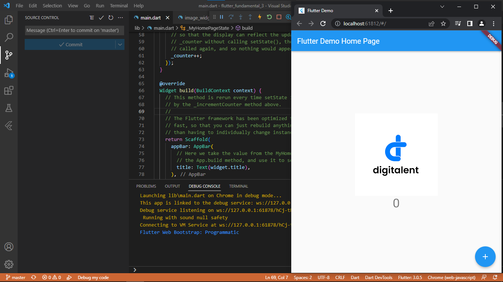
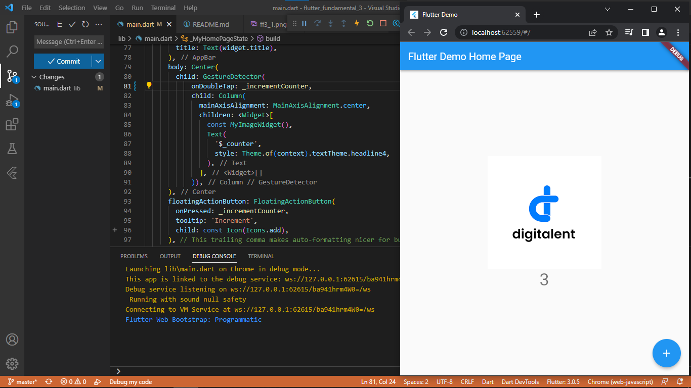
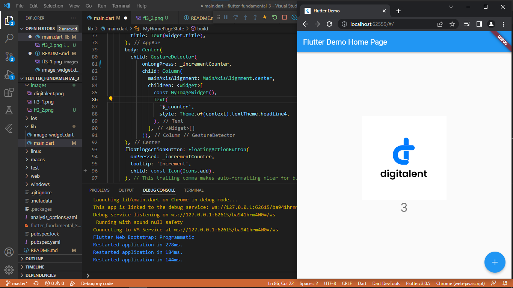
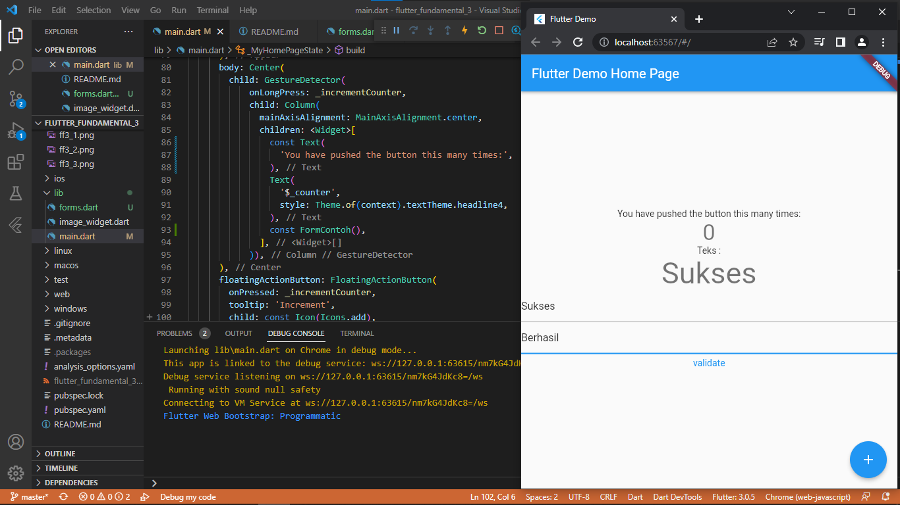
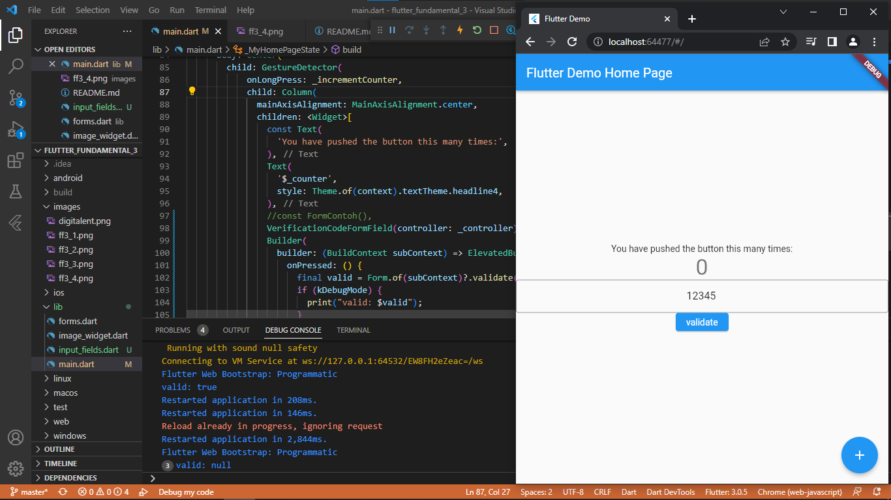

# flutter_fundamental_3

Praktik untuk dasar-dasar framework Flutter dengan menerapkan jenis-jenis gesture, input widget dan controller-nya serta melakukan custom input dan FormField widget.

## Praktikum 1
Menerapkan gesture detector

gambar diatas menampilkan hasil run dari praktikum 1 dimana yang mana menggunakan gesture onTab yang mana akan menambah counter ketika gambar di tab

gambar diatas menampilkan hasil run dari praktikum 1 dimana yang mana menggunakan gesture onDoubleTab yang mana akan menambah counter ketika gambar di double click

gambar diatas menampilkan hasil run dari praktikum 1 dimana yang mana menggunakan gesture onLongPress yang mana akan menambah counter ketika gambar di tekan 

## Praktikum 2
Menerapkan Input Widget dan Forms

gambar diatas menampilkan hasil run dari paraktikum 2 yaitu menggunakan input widget dan form. pada gambar diatas dapat dilihat bahwa text yang berada di center mengikuti hasil input yang ada pada form baris pertama.

## Praktikum 3
Menerapkan Custom Input dan FormField Widget

gambar diatas menampilkan hasil run dari praktikum 3 yaitu menggunakan custom input. kurang lebih sama seperti sebelumnya akan tetapi text yang dapat diinputkan hanyalah tipe angka.

